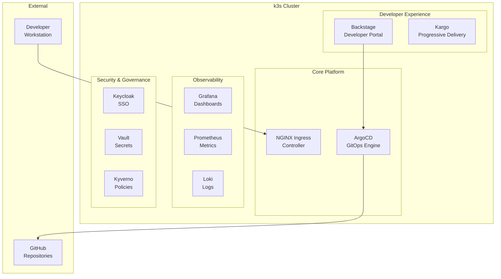

# Kubrix Internal Developer Platform (IDP) on k3s

A complete GitOps-based Internal Developer Platform running on k3s, featuring ArgoCD, Backstage, Grafana, and more.

## 📋 Table of Contents

- [Overview](#overview)
- [Architecture](#architecture)
- [Prerequisites](#prerequisites)
- [Quick Start](#quick-start)
- [Detailed Installation](#detailed-installation)
- [Accessing Services](#accessing-services)
- [Configuration](#configuration)
- [Troubleshooting](#troubleshooting)
- [Managing Applications](#managing-applications)
- [Development Guide](#development-guide)
- [Backup and Recovery](#backup-and-recovery)
- [Known Issues](#known-issues)
- [Contributing](#contributing)

## 🎯 Overview

Kubrix is a comprehensive Internal Developer Platform (IDP) that provides:

- **GitOps Deployment**: ArgoCD for continuous deployment
- **Developer Portal**: Backstage for service catalog and documentation
- **Monitoring**: Grafana and Prometheus for observability
- **Security**: Keycloak for SSO, Vault for secrets management
- **Progressive Delivery**: Kargo for multi-stage deployments
- **Policy Management**: Kyverno for Kubernetes policies
- **Certificate Management**: cert-manager for TLS certificates

### Key Features

- 🚀 **One-click deployment** using GitOps principles
- 🔄 **Automated sync** of applications from Git repositories
- 📊 **Built-in monitoring** and observability
- 🔐 **Enterprise-grade security** with SSO and secrets management
- 🎯 **Developer-friendly** portal for service discovery
- 📦 **Pre-configured applications** with best practices

## 🏗️ Architecture



### Component Stack

| Component | Purpose | Version | Status |
|-----------|---------|---------|--------|
| ArgoCD | GitOps continuous deployment | v2.8.4 | ✅ Active |
| Backstage | Developer portal | Latest | ⚠️ Placeholder only |
| Grafana | Monitoring dashboards | Latest | ✅ Active |
| Keycloak | Single Sign-On (SSO) | Latest | ⚠️ Needs config |
| Vault | Secrets management | Latest | ⚠️ Needs init |
| Kargo | Progressive delivery | Latest | ⚠️ Not deployed |
| Prometheus | Metrics collection | Latest | ⚠️ CRDs only |
| Loki | Log aggregation | Latest | ✅ Active |
| cert-manager | Certificate management | Latest | ✅ Active |
| Kyverno | Policy engine | Latest | ✅ Active |
| Ingress NGINX | Ingress controller | Latest | ✅ Active |

## 📚 Prerequisites

### System Requirements

- **k3s cluster**: Running on Ubuntu VM (tested with UTM on macOS)
- **kubectl**: Configured to access your k3s cluster
- **GitHub account**: For repository storage
- **macOS/Linux**: Local development machine

### Required Tools

```bash
# Check if tools are installed
make check-prerequisites

# Or install manually
brew install kubectl helm yq gomplate
```

### k3s VM Configuration

- **VM IP**: 192.168.64.4 (adjust in Makefile if different)
- **Ports**: 6443 (API), 80/443 (HTTP/HTTPS), 30000-32767 (NodePorts)
- **Firewall**: Allow traffic from your Mac to VM

```bash
# On Ubuntu VM, open required ports
sudo ufw allow 6443/tcp
sudo ufw allow 80/tcp
sudo ufw allow 443/tcp
sudo ufw allow 30000:32767/tcp
```

## 🚀 Quick Start

```bash
# 1. Clone this repository
git clone https://github.com/petmar2017/kubrix.git
cd kubrix

# 2. Install Kubrix
make install

# 3. Start port forwarding
make port-forward

# 4. Check status
make status

# 5. Access ArgoCD
open http://localhost:8080
# Username: admin
# Password: aFsfe93a-OgZSpby
```

## 📖 Detailed Installation

### Step 1: Environment Setup

Create a `.env` file with your configuration:

```bash
cat > .env << EOF
KUBRIX_CUSTOMER_REPO=https://github.com/petmar2017/kubrix-platform
KUBRIX_CUSTOMER_REPO_TOKEN=<your-github-token>
KUBRIX_CUSTOMER_TARGET_TYPE=DEMO-STACK
KUBRIX_CUSTOMER_DNS_PROVIDER=local
KUBRIX_CUSTOMER_DOMAIN=kubrix.local
EOF
```

### Step 2: Update Hosts File

Add Kubrix domains to `/etc/hosts`:

```bash
sudo make fix-hosts

# Or manually add:
# 192.168.64.4 argocd.kubrix.local
# 192.168.64.4 backstage.kubrix.local
# 192.168.64.4 keycloak.kubrix.local
# 192.168.64.4 kargo.kubrix.local
# 192.168.64.4 vault.kubrix.local
# 192.168.64.4 grafana.kubrix.local
# 192.168.64.4 prometheus.kubrix.local
```

### Step 3: Bootstrap Kubrix

```bash
# Run the bootstrap script
./scripts/bootstrap-kubrix.sh

# Or use make
make bootstrap
```

### Step 4: Install Missing CRDs (k3s specific)

```bash
# Install monitoring CRDs that k8s-monitoring requires
make dev-monitoring-crds
```

## 🌐 Accessing Services

### Port Forwarding (Recommended)

```bash
# Start all port forwards
make port-forward

# Access services
# ArgoCD:  http://localhost:8080
# Grafana: http://localhost:3000
# Ingress: http://localhost:8880
```

### Direct Access via NodePort

```bash
# Access through NodePort 30404
curl -H "Host: argocd.kubrix.local" http://192.168.64.4:30404
curl -H "Host: grafana.kubrix.local" http://192.168.64.4:30404
```

### Using the Helper Script

```bash
# Quick access helper
./kubrix-access.sh open argocd   # Opens ArgoCD in browser
./kubrix-access.sh open grafana  # Opens Grafana in browser
./kubrix-access.sh status        # Check port-forward status
./kubrix-access.sh restart       # Restart all port-forwards
```

### Service Credentials

| Service | Username | Password | URL |
|---------|----------|----------|-----|
| ArgoCD | admin | aFsfe93a-OgZSpby | http://localhost:8080 |
| Grafana | admin | (check pod logs) | http://localhost:3000 |
| Backstage | - | - | http://localhost:8880 (Host: backstage.kubrix.local) |
| Keycloak | admin | (when deployed) | Not yet available |

## ⚙️ Configuration

### ArgoCD Applications

All applications are managed through ArgoCD. To view:

```bash
# List all applications
kubectl get applications -n argocd

# Check application status
kubectl describe application <app-name> -n argocd

# Force sync an application
kubectl patch application <app-name> -n argocd --type merge \
  -p '{"operation":{"sync":{"revision":"main"}}}'
```

### Adding New Applications

1. Create application manifest in `platform-apps/`
2. Commit to your platform repository
3. ArgoCD will automatically detect and deploy

### Customizing Values

Edit the appropriate `values-*.yaml` files in your platform repository:
- `values-demo-stack.yaml`: Demo environment settings
- `values-production.yaml`: Production settings

## 🔧 Troubleshooting

### Common Issues

#### 1. k3s Connection Issues

```bash
# Check connectivity
kubectl get nodes

# If failed, check:
# - VM is running
# - Firewall allows port 6443
# - KUBECONFIG is correct
```

#### 2. Applications Stuck in "Unknown" State

```bash
# Force refresh
make update

# Or manually sync
make sync-apps
```

#### 3. Backstage Not Deploying

Backstage requires PostgreSQL. Deploy standalone instance:

```bash
make dev-postgres
```

#### 4. Port Forwarding Stops

```bash
# Restart port forwards
make restart-forward

# Or use the helper
./kubrix-access.sh restart
```

### Debug Commands

```bash
# Debug specific application
make debug-app APP=sx-backstage

# Check logs
make logs

# View all CRDs
make check-crds

# Test ingress endpoints
make test-ingress
```

## 📦 Managing Applications

### Using ArgoCD UI

1. Access ArgoCD: http://localhost:8080
2. View application status and history
3. Manually sync or rollback applications
4. Configure auto-sync policies

### Using CLI

```bash
# Sync all applications
make sync-apps

# Update specific application
kubectl annotate application <app-name> -n argocd \
  argocd.argoproj.io/refresh=true --overwrite

# Delete application
kubectl delete application <app-name> -n argocd
```

### Application Sync Waves

Applications deploy in waves to handle dependencies:

- **Wave -10 to -1**: Core infrastructure (ArgoCD, cert-manager)
- **Wave 0-5**: Platform services (Vault, PostgreSQL, Keycloak)
- **Wave 6-10**: Application layer (Backstage, monitoring)
- **Wave 11+**: Additional tools and user applications

## 💻 Development Guide

### Local Development

```bash
# Port forward for development
kubectl port-forward svc/postgres -n postgres 5432:5432
kubectl port-forward svc/vault -n kubrix-vault 8200:8200

# Watch application logs
kubectl logs -f deployment/<app> -n <namespace>
```

### Adding Custom Applications

1. Create Helm chart in `platform-apps/charts/`
2. Add ArgoCD application manifest
3. Configure appropriate sync wave
4. Test locally before committing

### Testing Changes

```bash
# Dry run with Helm
helm template . -f values-demo-stack.yaml

# Test with ArgoCD
argocd app diff <app-name>
```

## 💾 Backup and Recovery

### Backup

```bash
# Backup all configurations
make backup

# Backup specific namespace
kubectl get all -n <namespace> -o yaml > backup-<namespace>.yaml
```

### Restore

```bash
# Restore from backup
make restore BACKUP_DATE=20240119-140523

# Restore specific application
kubectl apply -f backups/applications-<date>.yaml
```

## ⚠️ Known Issues

### k3s Specific

1. **LoadBalancer Services**: No external IP assigned in VM setup
   - **Solution**: Use NodePort or port-forwarding

2. **k8s-monitoring**: Requires cluster name configuration
   - **Solution**: Monitoring CRDs installed manually

3. **Ingress Webhook**: TLS certificate validation issues
   - **Solution**: Webhook removed, ingresses work without validation

### Platform Issues

1. **Backstage**: Requires CNPG CRDs or external PostgreSQL
2. **Vault**: Needs initialization after deployment
3. **Keycloak**: Requires database configuration

## 🤝 Contributing

1. Fork the repository
2. Create a feature branch
3. Make your changes
4. Test thoroughly
5. Submit a pull request

### Development Workflow

```bash
# Create feature branch
git checkout -b feature/my-feature

# Make changes and test
make install
make status

# Commit and push
git add -A
git commit -m "Add my feature"
git push origin feature/my-feature
```

## 📝 License

This project is licensed under the MIT License - see the LICENSE file for details.

## 🙏 Acknowledgments

- [Kubrix Platform](https://github.com/suxess-it/kubriX) - Original platform
- [k3s](https://k3s.io/) - Lightweight Kubernetes
- [ArgoCD](https://argoproj.github.io/cd/) - GitOps engine
- [Backstage](https://backstage.io/) - Developer portal platform

## 📞 Support

For issues and questions:
- Check the [Troubleshooting](#troubleshooting) section
- Review [Known Issues](#known-issues)
- Open an issue on GitHub
- Check ArgoCD UI for application-specific errors

---

Made with ❤️ for the Kubrix community